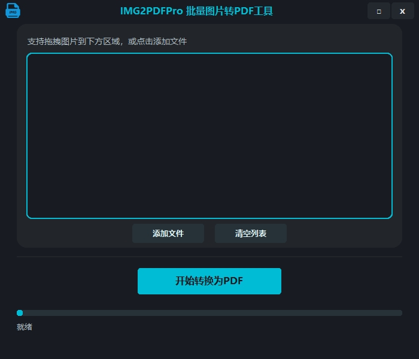

# IMG2PDFPro

## 简介
IMG2PDFPro 是一款基于 Python、Tkinter 和 customtkinter 开发的高颜值批量图片转 PDF 工具。支持通过按钮选择或拖拽图片文件，一键自动生成 PDF 文件，适合批量图片归档、资料整理等场景。



## 主要功能
- 支持 PNG、JPG、JPEG 等常见图片格式批量转 PDF
- 支持拖拽图片文件到界面
- 自动在图片所在文件夹生成 PDF（以时间戳命名）
- 进度条与状态栏实时提示
- 高端美观的深色 UI 界面

## 使用方法
1. 启动程序：
   ```powershell
   uv run IMG2PDFPro/main.py
   ```
2. 选择图片：
   - 点击“添加文件”按钮选择一张或多张图片，或直接拖拽图片到列表区域。
3. 点击“开始转换为PDF”按钮，程序会自动在图片所在文件夹下生成 PDF 文件，文件名为当前时间戳。
4. 可点击“清空列表”按钮重置。

## 依赖环境
- Python 3.8+
- customtkinter
- img2pdf
- tkinterdnd2

安装依赖（推荐使用 uv）：
```powershell
uv add customtkinter img2pdf tkinterdnd2
```

## 常见问题
- 拖拽功能需 tkinterdnd2 支持，部分平台需手动安装 tkdnd。
- 生成的 PDF 文件名为当前时间戳，保存在所选图片的同一文件夹。
- 若遇到界面显示异常，请确保已安装所有依赖并使用 Python 3.8 及以上版本。

## 目录结构
```
IMG2PDFPro/
  main.py         # 程序入口
  ui.py           # UI界面与交互
  logic.py        # 图片转PDF核心逻辑
  README.md       # 说明文档
```

## 开源协议
本项目遵循 MIT License，欢迎学习和二次开发。


