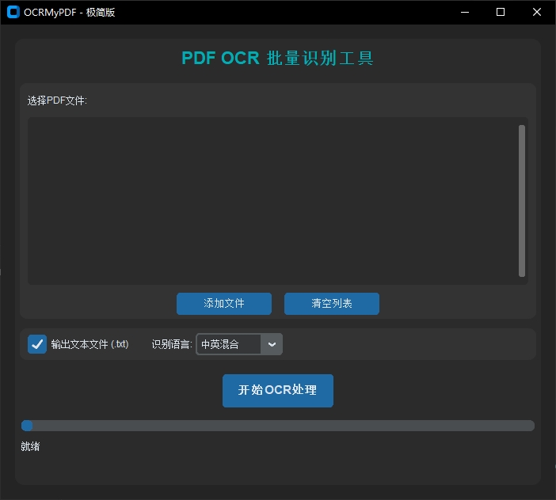

# OCRmyPDF 说明文档

## 项目简介

`OCRmyPDF` 基于 Python 开发，主要用于对 PDF 文件进行批量文字识别（OCR），并生成可搜索的 PDF 文档。



## 目录结构

- `app.py`：负责界面。
- `main.py`：主程序入口。
- `ocr_processor.py`：OCR 处理核心模块，封装了对 PDF 的识别与处理。
- `__pycache__/`：Python 编译生成的缓存文件夹。

## 依赖环境

- Python 3.12 及以上
- 推荐使用虚拟环境
- 主要依赖库：
  - ocrmypdf
  - 其他依赖请参考项目根目录的 `pyproject.toml` 或 `uv.lock`
  - Tesseract、GhostScript（需自行安装并添加到环境变量）

## 快速开始

1. 安装依赖：
    ```bash
    git clone https://gitee.com/tabortao/MyOCR
    cd MyOCR
    uv venv .venv # 创建虚拟环境
    .venv\Scripts\activate # 激活虚拟环境
    uv pip install -r pyproject.toml # 安装依赖
    ```
2. 运行主程序：
    ```bash
    uv run OCRmyPDF/main.py
    ```
## 第三方依赖安装
### Tesseract
> Tesseract 是由 HP（惠普）实验室开发，后由 Google 维护的开源 OCR（光学字符识别）引擎。它支持多种语言和文字，能识别印刷体和部分手写体，广泛应用于文档数字化、自动化数据提取等领域。

1. 下载Tesseract
[Tesseract下载地址](https://tesseract-ocr.github.io/tessdoc/Installation.html),其中[Windows版下载地址](https://github.com/UB-Mannheim/tesseract/wiki),比如我下载了`tesseract-ocr-w64-setup-5.5.0.20241111.exe`。
2. Tesseract安装
双击下载好的exe程序，选择要支持识别的语言。

3. 把`D:\Program Files\Tesseract-OCR`添加到用户环境变量。


### GhostScript
> Ghostscript 是一款开源的 PostScript (PS) 和 PDF 解释器，最初由 Aladdin Enterprises 开发，现由 Artifex Software 维护。它能解析、渲染和转换 PS/EPS/PDF/XPS 文件，支持输出到打印设备或生成栅格化图像（如 JPEG、PNG）。

1. 下载GhostScript
[GhostScript下载地址](https://ghostscript.com/releases/gsdnld.html)
2. GhostScript安装
3. 把`D:\Program Files\gs\gs10.05.1\bin`添加到用户环境变量。


## 功能说明

- 支持批量 PDF 文件 OCR 识别
- 支持命令行与图形界面两种模式
- 识别后生成可搜索的 PDF 文件

## 相关文档

- [批量识别说明](../docs/OCRmyPDF手册/批量识别.md)
- [OCRMyPDF使用说明](../docs/OCRmyPDF手册/OCRMyPDF使用说明.md)

## 联系与反馈

如有问题或建议，请在项目 issue 区留言。
