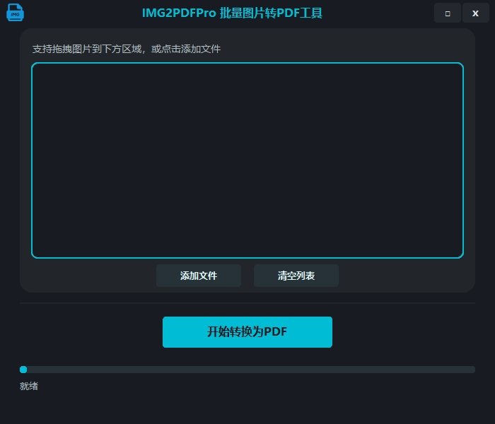

## IMG2PDFPro -20250606
> IMG2PDFPro 是一款基于 Python、Tkinter 和 customtkinter 开发的高颜值批量图片转 PDF 工具。支持通过按钮选择或拖拽图片文件，一键自动生成 PDF 文件，适合批量图片归档、资料整理等场景。

## OCRmyPDF -20250603

> `OCRmyPDF` 基于 开源Python应用 [OCRmyPDF](https://github.com/ocrmypdf/OCRmyPDF)开发的UI程序，主要用于对 PDF 文件进行批量文字识别（OCR），并生成可搜索的 PDF 文档（双层PDF文件）。

